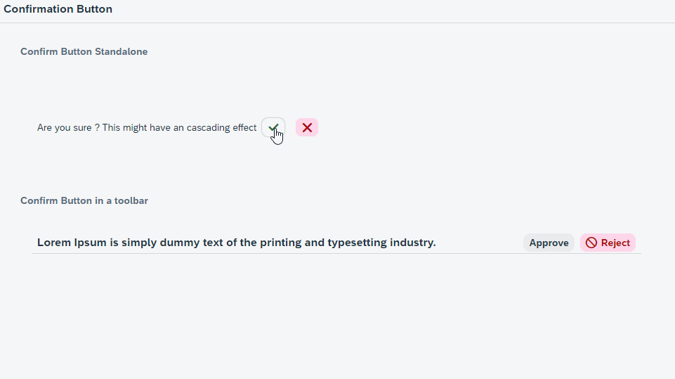

# SAP UI5 Confirm Button

Create In-Place confirmation question using the **Confirmation Button Custom Conrol**. Using this you can skip the process of adding a dialog and controller coding to handle opening of confirmation dialog and subsequent actions

# Options

- Properties 
	-  confirmText : The text that should be displayed while confirming the user action
- Aggregations
	- primaryButton : 	Type(sap.m.Button) - Initial Button that should be displayed
	- confirmButton : 	Type(sap.m.Button) - The ok Button on whose press event the actual activity should happen
	- rejectButton: 		Type(sap.m.Button) - The Cancel Button

## Credits

This project has been generated with 💙 and [easy-ui5](https://github.com/SAP)
